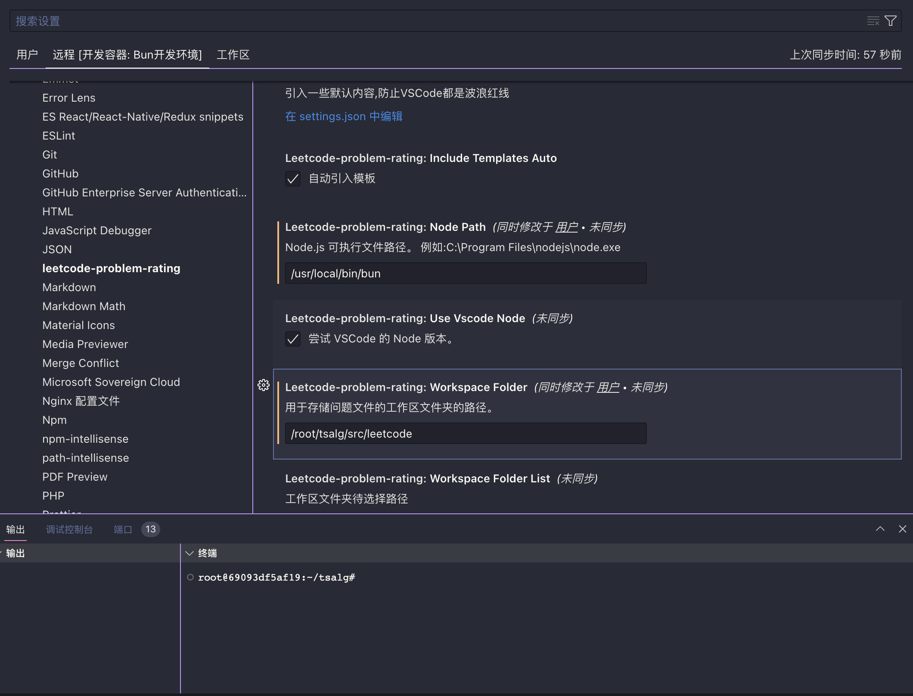

# Typescript-Algorithms

基于 Bun + Typescript 实现常见算法、数据结构以及 Leetcode 经典题目

## 使用 Dev Container

由于 Bun 在 windows 环境下支持度不太良好，为了解决这么一个问题，我在项目当中配置了一个基于 Bun 环境的 Dev Container。你只需要在你的电脑本机下载 Docker + VSCode Dev Container 插件，就可以使用这个项目的 Dev Container 进行代码开发和书写了。

## 项目开发流程

整个项目用来练习算法数据结构，从`造轮子 -> 测轮子 -> 用轮子`的流程进行：

- 造轮子：造轮子又可以继续划分出定义轮子（表明你的轮子要做啥用的）和实现轮子（将你的轮子用代码实现出来）两个环节
- 测轮子：轮子造完了，怎么知道轮子造的对不对，好不好用？搞测试用例测试你的轮子（bun 天然支持 test）
- 用轮子：随便想些场景数据去使用你自己造的轮子（其实跟测轮子本质一样都是在使用自己造的轮子）

## 使用 Leetcode 插件

### 配置 leetcode 环境

分别需要到`设置`中找到`用户`和`远程{开发容器}`两个配置里头设置如下两个地方：

- 配置右键运行代码时使用 bun 替代使用 node：`/usr/local/bin/bun`
- 配置项目的 leetcode 文件夹：`/root/tsalg/src/leetcode`

#### 用户配置


#### 容器配置



### 解决登录 Leetcode 的问题

项目使用了扩展 ID 为`ccagml.vscode-leetcode-problem-rating`的 LeetCode 插件，并将其放到了 Dev Container 的远程 VSCode 当中作为插件了。登录如果使用账号密码可能有问题，解决的方式就是使用 cookie 的登录方式，输入自己的用户名或者邮箱之后，到了 coolie 这个输入步骤按照如下格式复制粘贴，修改成你自己的`csrftoken`+ `LEETCODE_SESSION`（这两个可以到 leetcode.cn 打开控制台 Application 找到 cookie 中可以看到），下面给出格式：

```shell
csrftoken="你的csrftoken"; LEETCODE_SESSION="你的LEETCODE_SESSION";
```
